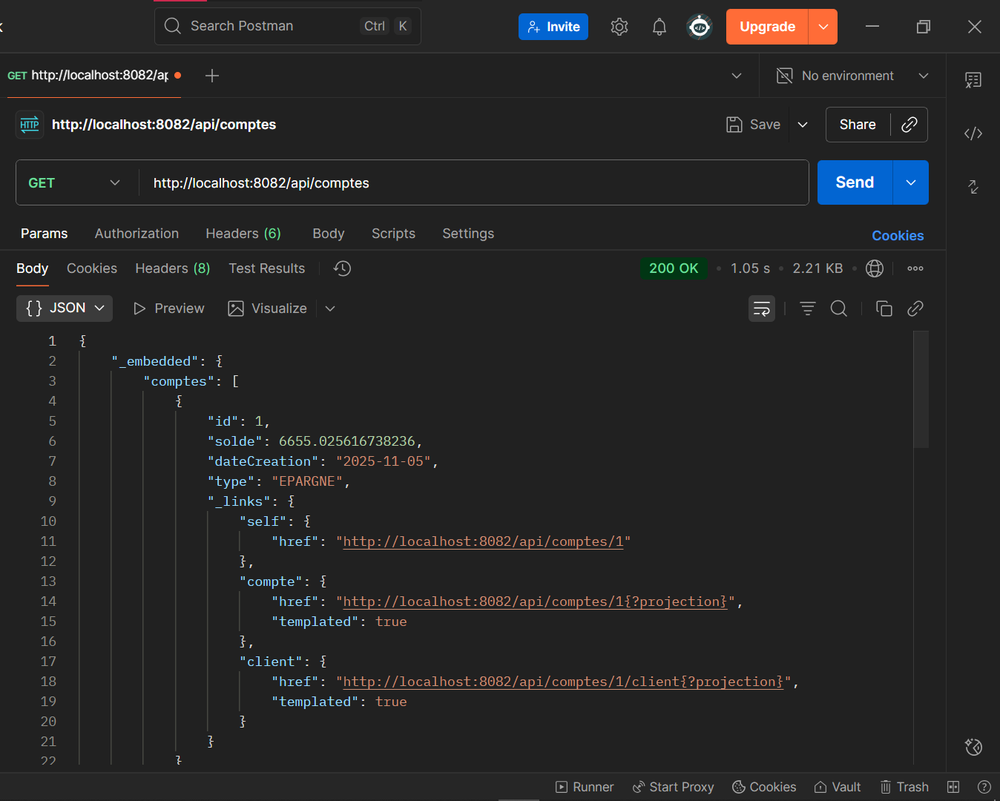
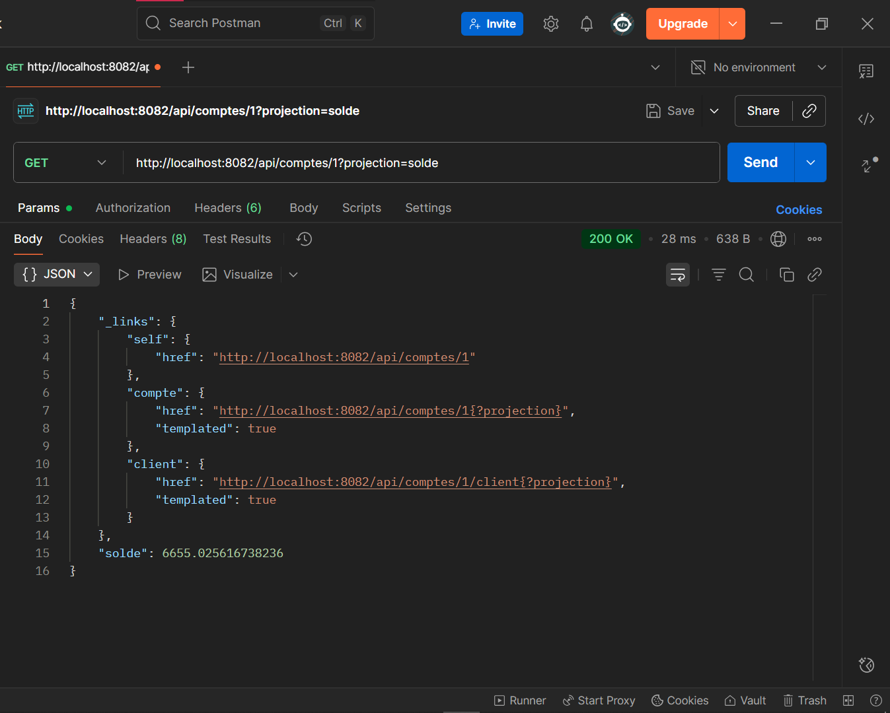
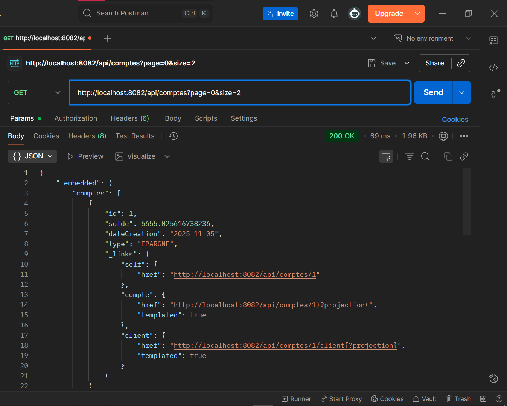
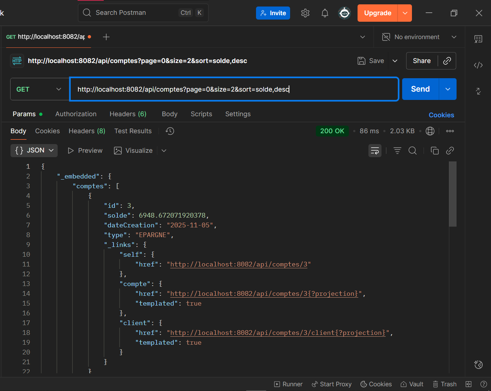

# TP11 - Spring Data REST

## Description
Ce projet est une application Spring Boot qui utilise Spring Data REST pour exposer des entités via une API RESTful. Il inclut des fonctionnalités telles que la pagination, le tri et les projections.

## Structure du projet

```
TP11/
├── mvnw
├── mvnw.cmd
├── pom.xml
├── src/
│   ├── main/
│   │   ├── java/
│   │   │   └── ma/
│   │   │       └── rest/
│   │   │           └── SpringDataREST/
│   │   │               ├── MsBanqueApplication.java
│   │   │               ├── entities/
│   │   │               │   ├── Client.java
│   │   │               │   ├── ClientProjection.java
│   │   │               │   ├── Compte.java
│   │   │               │   ├── CompteProjection1.java
│   │   │               │   ├── CompteProjection2.java
│   │   │               │   └── TypeCompte.java
│   │   │               ├── repositories/
│   │   │               │   ├── ClientRepository.java
│   │   │               │   └── CompteRepository.java
│   ├── resources/
│   │   └── application.properties
├── target/
│   ├── classes/
│   │   ├── application.properties
│   │   └── ma/
│   │       └── rest/
│   │           └── SpringDataREST/
│   │               ├── entities/
│   │               └── repositories/
│   ├── generated-sources/
│   │   └── annotations/
│   ├── generated-test-sources/
│   │   └── test-annotations/
│   └── test-classes/
│       └── ma/
│           └── rest/
│               └── SpringDataREST/
```

## Fonctionnalités

### Pagination
L'API prend en charge la pagination. Exemple de requête :
```
GET http://localhost:8082/api/comptes?page=0&size=2
```

### Tri
L'API permet de trier les résultats. Exemple de requête :
```
GET http://localhost:8082/api/comptes?page=0&size=2&sort=solde,desc
```

### Projections
Les projections permettent de personnaliser les données retournées par l'API.

#### Projection "solde"
```
GET http://localhost:8082/api/comptes/1?projection=solde
```
Réponse :
```json
{
  "_links": {
    "self": {
      "href": "http://localhost:8082/api/comptes/1"
    },
    "compte": {
      "href": "http://localhost:8082/api/comptes/1{?projection}",
      "templated": true
    },
    "client": {
      "href": "http://localhost:8082/api/comptes/1/client{?projection}",
      "templated": true
    }
  },
  "solde": 6655.025616738236
}
```

#### Projection "mobile"
```
GET http://localhost:8082/api/comptes/1?projection=mobile
```
Réponse :
```json
{
  "_links": {
    "self": {
      "href": "http://localhost:8082/api/comptes/1"
    },
    "compte": {
      "href": "http://localhost:8082/api/comptes/1{?projection}",
      "templated": true
    },
    "client": {
      "href": "http://localhost:8082/api/comptes/1/client{?projection}",
      "templated": true
    }
  },
  "type": "EPARGNE",
  "solde": 6655.025616738236
}
```

## Exécution

1. Clonez le projet :
```
git clone <url-du-repo>
```

2. Lancez l'application :
```
./mvnw spring-boot:run
```

3. Accédez à l'API via Postman ou un navigateur à l'adresse :
```
http://localhost:8082/api/comptes
```

## Captures d'écran

### Exemple de réponse avec projection "solde"


### Exemple de réponse avec pagination


### Exemple de réponse avec tri


### Exemple de réponse avec projection "mobile"


### Autre capture d'écran


## Auteur
Abdel

---
